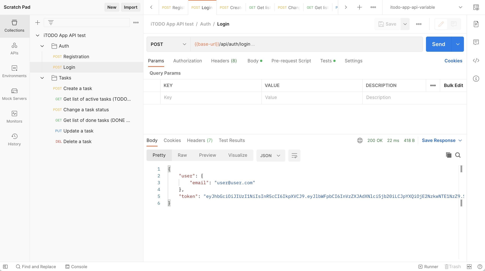

# iTODO app endpoint implementation

This is a simple task list management application.
To access the list of tasks, you must register and log in to the application. After that, you get access to your task list.
Using endpoint calls, you can create an actual task and add it to the TODO list. The list of active tasks is available in the "TODO" section.
You can change the status of a task by marking it with a marker. The completed task is moved to the DONE list. You can also update the task title and description, or delete it entirely.

## Technologies used

- **[Node.js](https://nodejs.org/en/)** - As an asynchronous event-driven JavaScript runtime, Node.js is designed to build scalable network applications..
- **[Express](https://expressjs.com/)** – Express is a minimal and flexible Node.js web application framework.
- **[MongoDB](https://www.mongodb.com/)** - NoSQL database.
- **[Mongoose](https://mongoosejs.com/)** - Straight-forward, schema-based solution to model your application data.
- And other requirements which are in the package.json file.

## Local development

The project comes with a basic configuration for local start. To run MongoDB locally, you must have Docker installed on your pc.

> Get the code

```bash
git clone https://gitlab.com/chkvdm/advanced-node.js.git
cd itodo-app-endpoint-implementation
```

> Install all package and requiremets.

```bash
npm install
```

> Start the MongoDB locally.

```bash
docker-compose up --build
```

> Start the app

```bash
npm run start
```

mongodb will bw start on 37017 port
app will be start on http://localhost:3000

## Testing

The project includes a complete postman collection of HTTP requests to all API endpoints. You can imported postman collection [from](./postman/). Also project includes complete autotest collection.

> Test API with postman collection.



> Start autotest.

```bash
npx mocha test
```

## License

[](https://opensource.org/licenses/MIT)
